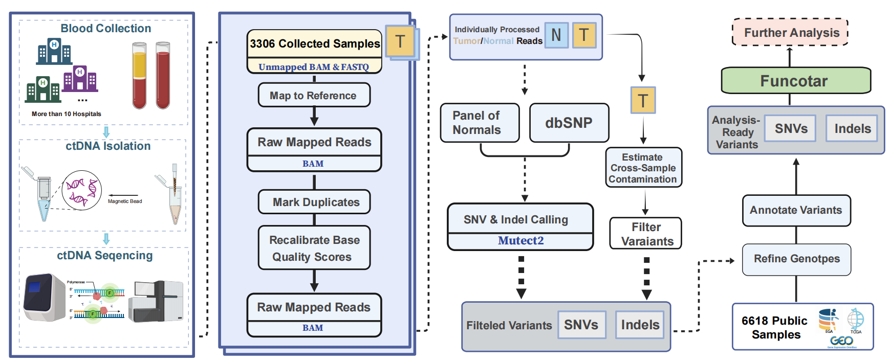

# cfDNA Mutect2 Pipeline Generator

**cfDNA Mutect2 Pipeline Generator** is a lightweight pipeline generator for tumor-only cfDNA somatic mutation calling. It creates standalone shell scripts for Mutect2 calling, contamination estimation, filtering, ANNOVAR annotation, and final mutation table aggregation from a YAML configuration file.

## Introduction



This tool does not run all analysis jobs automatically inside Python. Instead, it generates an independent shell-based project that can be submitted and monitored manually on a local server or computing cluster.

```bash
$ python generate_pipeline.py -h
usage: cfdna-mutect2-generate [-h] [-v] --config CONFIG [--outdir OUTDIR]

cfDNA Mutect2 Pipeline Generator (Version = 0.1.0): Generate tumor-only cfDNA Mutect2 shell scripts from a YAML config.

optional arguments:
  -h, --help       show this help message and exit
  -v, --version    show the version of cfdna-mutect2-generate and exit.
  --config CONFIG  YAML config file.
  --outdir OUTDIR  Override project.outdir from the YAML config.
```

## Installation

Run directly from the source directory:

```bash
cd /400T/ckn/cfDNA_Mutect2_generator
python generate_pipeline.py -h
```

Optional local installation:

```bash
python -m pip install -e .
```

After installation, the command-line entry point is:

```bash
cfdna-mutect2-generate -h
```

## Quick Start

Generate the example bladder cfDNA Mutect2 project:

```bash
cd /400T/ckn/cfDNA_Mutect2_generator
python generate_pipeline.py --config examples/config.bladder.yaml
```

Or after installation:

```bash
cfdna-mutect2-generate --config examples/config.bladder.yaml
```

Run the generated project:

```bash
cd /400T/ckn/database_code/bladder_mutect2_project
bash 00.shell/run_pipeline.sh help
bash 00.shell/run_pipeline.sh all
```

For background execution:

```bash
nohup bash 00.shell/run_pipeline.sh all > loginfo/pipeline.nohup.log 2>&1 &
```
